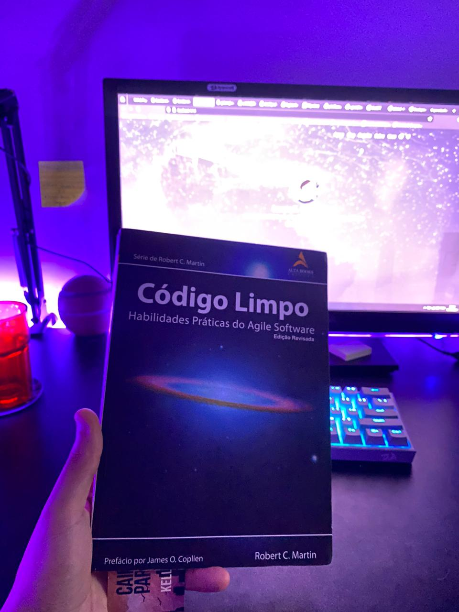
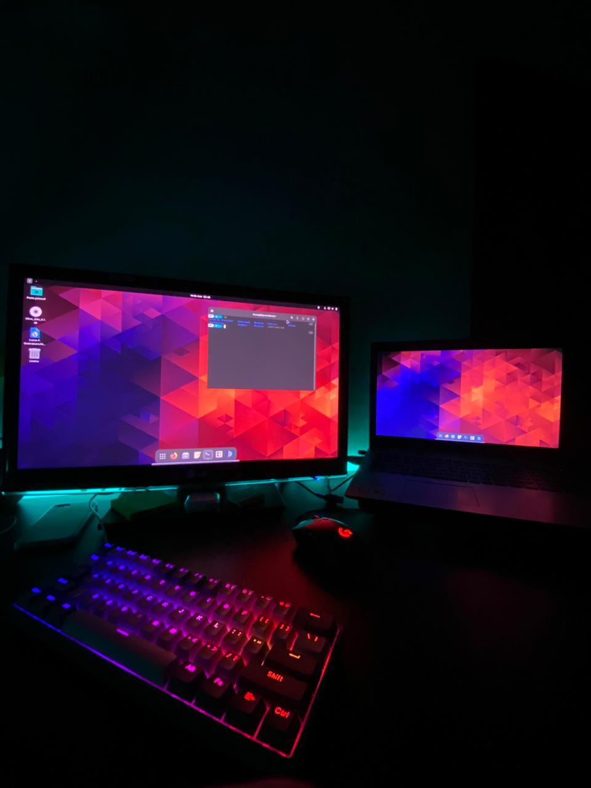

*Está é uma now page, um lugar para compartilhar no que estou focado no momento.*

 

- Fazendo desafios variados com JS.
- Estudando **TypeScript** após pegar um bom conhecimento com **JS Vanilla**
- Finalmente lendo o meu procrastinado livro, o **[Codigo Limpo](https://www.amazon.com.br/C%C3%B3digo-limpo-Robert-C-Martin/dp/8576082675)**
- Començando no mundo do **Linux** ([Mint](https://linuxmint.com/)).
- Aprendendo a usar [Neovim](https://neovim.io/) *(Em breve o substituto definitivo do meu VSCode)*.

    

    

 

#### Se quiser saber mais sobre o assunto, [What is a “now page”?][nowpage].

[nowpage]: https://nownownow.com/about