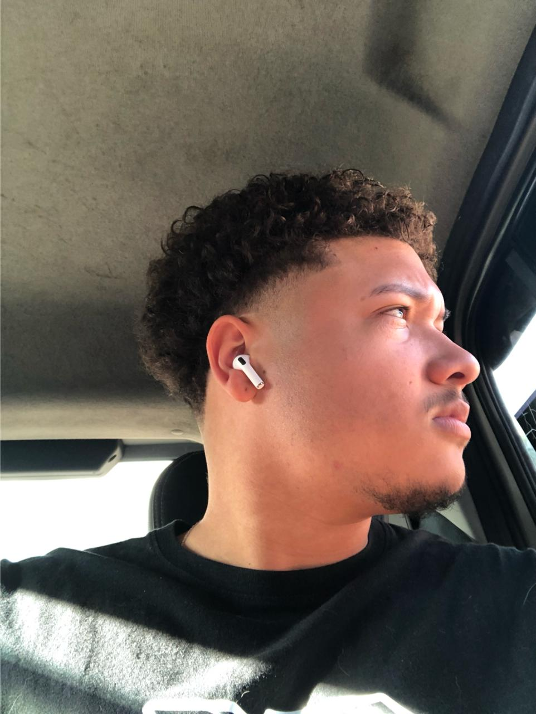

Meu nome é Lucas Fernandes Guanabara, Nascido em 2003, São Paulo, Graduando em **Sistemas de Informação**.
Sou um entusiasta da tecnologia apaixonado pela arte da programação, com
Grande foco em **Desenvolvimento WEB**

## Jornada

Minha jornada nesse mundo começou lá em 2015 (aos meus 12 anos), onde tive o primeiro contato com HTML e Hardware's de computadores, lembro que meu pai pegava computadores que estavam sendo descartados do serviço dele, e levava pra casa, onde eu amava montar e desmontar (Nenhuma peça de fato funcionava 😅), em 2019 comecei um curso de Tecnico em Informatica no SENAC, mas não o finalizei por motivos finaceiros. No segundo semestre de 2021 comecei minha faculdade de Sistemas de Informação, mas foi em 2022 que decidi mergulhar de cabeça nos estudos e práticar programação com C++.

## Trajetória acadêmica

Ao longo da minha trajetória acadêmica, tive a oportunidade de me aprofundar C++, C#, Java, SQL, PHP, DATA ANALYTICS (DW/DM/BI), IOT. No entanto, minha sede por conhecimento vai além do curriculo academico. Por minha própria vontade, mergulhei e a em estudos envolvendo JavaScript, Typescript, Node.js, PHP, C++, MongoDB, React, UX/UI, APIs Rest, entre outras techs. A paixão por aprender é o que me impulsiona.

## Interesses

Tenho interesse em diferentes assuntos, dentre eles: **Fulltack Development, Ethical Hacking, Pentesting, Padrões de Design,** apaixonado por **Hardwares** em geral. gosto bastante de aprender e testar novas ferramentas e linguagens!  
No meu tempo livre gosto de jogar (de preferência algum RPG), assistir filmes/séries e desenvolver alguns projetos pessoais.

---

> *Adoro desafios e a complexidade da programação, me fascina. Enxergo a programação não apenas como uma profissão, mas como uma forma de expressão criativa, onde cada linha de código é uma oportunidade de criar algo inovador e funcional.*

